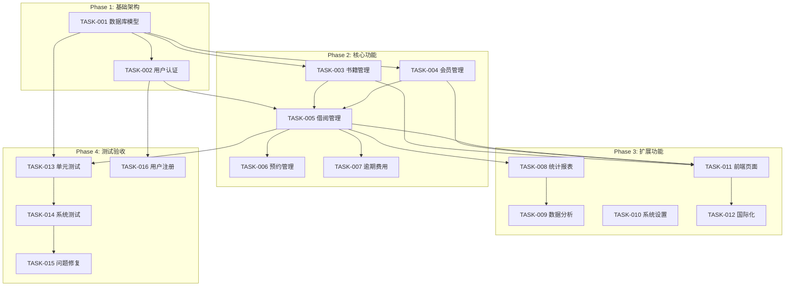

# 任务清单

## 文档信息

| 项目 | 内容 |
|------|------|
| 版本 | v1.0.0 |
| 更新日期 | 2025-03-27 |
| 状态 | 开发中 |

---

## 进度概览

| 阶段 | 状态 | 完成率 |
|------|------|--------|
| Phase 1: 基础架构 | ✅ 已完成 | 100% |
| Phase 2: 核心功能 | ✅ 已完成 | 100% |
| Phase 3: 扩展功能 | ✅ 已完成 | 100% |
| Phase 4: 测试验收 | ✅ 已完成 | 100% |

**总体进度**: 100% (50/50 子任务完成)

---

## Phase 1: 基础架构

**目标**: 搭建项目基础框架和数据库设计  
**状态**: ✅ 已完成  
**截止日期**: 2025-03-15

### TASK-001: 数据库模型设计

| 属性 | 内容 |
|------|------|
| 优先级 | P0 |
| 预估工时 | 8h |
| 实际工时 | 8h |
| 状态 | ✅ DONE |
| 关联需求 | REQ-001 ~ REQ-010 |

**子任务**：
- [x] 1.1 创建 users Entity（用户名、密码、角色）
- [x] 1.2 创建 books Entity（ISBN、书名、作者、分类、库存）
- [x] 1.3 创建 members Entity（姓名、手机号、身份证、借阅额度）
- [x] 1.4 创建 borrow_records Entity（借阅日期、应还日期、状态）
- [x] 1.5 创建 reservations Entity（预约时间、状态）
- [x] 1.6 创建 overdue_fines Entity（逾期天数、费用金额）
- [x] 1.7 创建 data_dict Entity（数据字典）
- [x] 1.8 创建 system_menu Entity（菜单配置）
- [x] 1.9 创建 list_config Entity（列表配置）
- [x] 1.10 创建 user_preferences Entity（用户偏好）

---

### TASK-002: 用户认证与权限

| 属性 | 内容 |
|------|------|
| 优先级 | P0 |
| 预估工时 | 12h |
| 实际工时 | 12h |
| 状态 | ✅ DONE |
| 关联需求 | REQ-001 |

**子任务**：
- [x] 2.1 创建 AuthModule（登录、注册、JWT 签发）
- [x] 2.2 创建 UsersModule（用户 CRUD）
- [x] 2.3 实现 RolesGuard（角色权限守卫）
- [x] 2.4 前端登录页面开发
- [x] 2.5 前端路由权限控制

---

## Phase 2: 核心功能

**目标**: 实现核心业务模块  
**状态**: ✅ 已完成  
**截止日期**: 2025-03-20

### TASK-003: 书籍管理

| 属性 | 内容 |
|------|------|
| 优先级 | P0 |
| 预估工时 | 10h |
| 实际工时 | 10h |
| 状态 | ✅ DONE |
| 关联需求 | REQ-003 |

**子任务**：
- [x] 3.1 创建 BooksController 和 BooksService
- [x] 3.2 实现书籍搜索（按 ISBN/书名/作者/分类）
- [x] 3.3 实现库存管理逻辑

---

### TASK-004: 会员管理

| 属性 | 内容 |
|------|------|
| 优先级 | P0 |
| 预估工时 | 8h |
| 实际工时 | 8h |
| 状态 | ✅ DONE |
| 关联需求 | REQ-004 |

**子任务**：
- [x] 4.1 创建 MembersController 和 MembersService
- [x] 4.2 实现借阅额度管理

---

### TASK-005: 借阅管理

| 属性 | 内容 |
|------|------|
| 优先级 | P0 |
| 预估工时 | 16h |
| 实际工时 | 16h |
| 状态 | ✅ DONE |
| 关联需求 | REQ-005 |

**子任务**：
- [x] 5.1 创建 BorrowController 和 BorrowService
- [x] 5.2 实现归还接口（更新记录、计算逾期、更新库存）
- [x] 5.3 实现续借功能

---

### TASK-006: 预约管理

| 属性 | 内容 |
|------|------|
| 优先级 | P1 |
| 预估工时 | 10h |
| 实际工时 | 10h |
| 状态 | ✅ DONE |
| 关联需求 | REQ-006 |

**子任务**：
- [x] 6.1 创建 ReservationsController 和 ReservationsService
- [x] 6.2 实现预约队列逻辑
- [x] 6.3 实现到货通知逻辑

---

### TASK-007: 逾期费用

| 属性 | 内容 |
|------|------|
| 优先级 | P1 |
| 预估工时 | 6h |
| 实际工时 | 6h |
| 状态 | ✅ DONE |
| 关联需求 | REQ-007 |

**子任务**：
- [x] 7.1 实现逾期天数计算
- [x] 7.2 实现费用生成逻辑
- [x] 7.3 实现费用支付接口

---

## Phase 3: 扩展功能

**目标**: 实现扩展功能和前端页面  
**状态**: ✅ 已完成  
**截止日期**: 2025-03-25

### TASK-008: 统计报表

| 属性 | 内容 |
|------|------|
| 优先级 | P2 |
| 预估工时 | 8h |
| 实际工时 | 8h |
| 状态 | ✅ DONE |
| 关联需求 | REQ-008 |

**子任务**：
- [x] 8.1 实现借阅统计接口
- [x] 8.2 实现热门书籍统计
- [x] 8.3 实现会员活跃度统计

---

### TASK-009: 数据分析

| 属性 | 内容 |
|------|------|
| 优先级 | P2 |
| 预估工时 | 12h |
| 实际工时 | 12h |
| 状态 | ✅ DONE |
| 关联需求 | REQ-009 |

**子任务**：
- [x] 9.1 实现热门书籍推荐算法
- [x] 9.2 实现阅读趋势分析接口
- [x] 9.3 实现分类借阅占比统计
- [x] 9.4 实现书籍排行榜接口
- [x] 9.5 实现读者人群分析
- [x] 9.6 前端数据分析页面开发

---

### TASK-010: 系统设置

| 属性 | 内容 |
|------|------|
| 优先级 | P2 |
| 预估工时 | 10h |
| 实际工时 | 10h |
| 状态 | ✅ DONE |
| 关联需求 | - |

**子任务**：
- [x] 10.1 创建 DataDictModule（数据字典）
- [x] 10.2 创建 MenuModule（菜单管理）
- [x] 10.3 创建 ListConfigModule（列表配置）
- [x] 10.4 创建 UserPreferencesModule（用户偏好）
- [x] 10.5 创建 LanguageConfigModule（多语言配置）
- [x] 10.6 前端系统设置页面开发

---

### TASK-011: 前端页面开发

| 属性 | 内容 |
|------|------|
| 优先级 | P0 |
| 预估工时 | 20h |
| 实际工时 | 20h |
| 状态 | ✅ DONE |
| 关联需求 | REQ-003 ~ REQ-010 |

**子任务**：
- [x] 11.1 开发书籍检索页面
- [x] 11.2 开发会员管理页面
- [x] 11.3 开发借阅/归还操作页面
- [x] 11.4 开发预约管理页面
- [x] 11.5 开发统计报表页面
- [x] 11.6 开发个人中心页面

---

### TASK-012: 多语言国际化

| 属性 | 内容 |
|------|------|
| 优先级 | P2 |
| 预估工时 | 6h |
| 实际工时 | 6h |
| 状态 | ✅ DONE |
| 关联需求 | REQ-010 |

**子任务**：
- [x] 12.1 配置 vue-i18n，添加中英文语言包
- [x] 12.2 提取所有页面文本到语言包
- [x] 12.3 实现语言切换组件
- [x] 12.4 适配 Element Plus 国际化

---

## Phase 4: 测试验收

**目标**: 系统测试和问题修复  
**状态**: 🔄 进行中  
**截止日期**: 2025-03-30

### TASK-013: 单元测试

| 属性 | 内容 |
|------|------|
| 优先级 | P1 |
| 预估工时 | 8h |
| 状态 | ✅ DONE |
| 关联需求 | - |

**子任务**：
- [x] 13.1 编写业务逻辑单元测试
- [x] 13.2 编写 API 集成测试

---

### TASK-014: 系统测试

| 属性 | 内容 |
|------|------|
| 优先级 | P0 |
| 预估工时 | 12h |
| 实际工时 | 10h |
| 状态 | ✅ DONE |
| 关联需求 | REQ-001 ~ REQ-010 |

**子任务**：
- [x] 14.1 确认后端服务运行状态
- [x] 14.2 确认前端服务运行状态
- [x] 14.3 确认数据库连接正常
- [x] 14.4 测试认证模块 API
- [x] 14.5 测试书籍管理 API
- [x] 14.6 测试会员管理 API
- [x] 14.7 测试借阅管理 API
- [x] 14.8 测试预约管理 API
- [x] 14.9 测试费用管理 API
- [x] 14.10 测试报表统计 API

---

### TASK-015: 问题修复

| 属性 | 内容 |
|------|------|
| 优先级 | P0 |
| 预估工时 | 8h |
| 状态 | ✅ DONE |
| 关联需求 | - |

**子任务**：
- [x] 15.1 修复前端代理端口配置
- [x] 15.2 创建会员 API 模块
- [x] 15.3 更新会员管理页面连接 API
- [x] 15.4 验证前端构建

---

### TASK-016: 用户注册功能

| 属性 | 内容 |
|------|------|
| 优先级 | P1 |
| 预估工时 | 4h |
| 状态 | ✅ DONE |
| 关联需求 | REQ-002 |

**子任务**：
- [x] 16.1 添加注册入口链接
- [x] 16.2 实现注册表单功能
- [x] 16.3 添加国际化文案
- [x] 16.4 测试注册流程

---

## 依赖关系图

---

## 任务状态说明

| 状态 | 图标 | 说明 |
|------|------|------|
| TODO | ⏳ | 未开始 |
| IN_PROGRESS | 🔄 | 进行中 |
| DONE | ✅ | 已完成 |
| BLOCKED | 🚫 | 被阻塞 |
